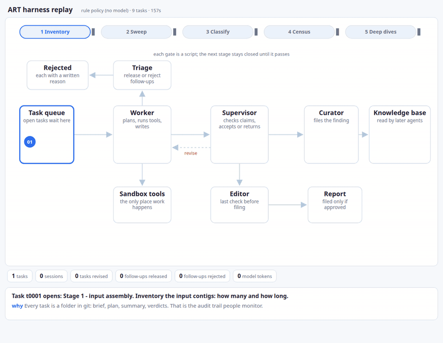

# art-harness

Faithful, self-contained reproduction of the autonomous research harness from:

> Yoon, Athukoralage, Ameisen, Kauderer-Abrams, Perry, Durrant et al. (Anthropic),
> **"Autonomous AI agents discover reverse transcriptases with tandem repeat arrays"** (2026-09-23).
> Paper PDF: https://www-cdn.anthropic.com/22573675ada52a8ca8a97a1a4b4326b2f208a071.pdf
> Announcement: https://www.anthropic.com/news/claude-discovers-novel-enzyme-system

<p align="center">
  
</p>

## What it is, in plain words

A research question is too big for one AI conversation. The paper's answer: split it
into many small **tasks**, let AI agents do them one at a time, and put **checks that are
plain code** between the agents so a wrong claim cannot slide through.

- A **worker** agent takes one task, runs tools, and writes what it found.
- A **supervisor** checks every claim against the tool log. If a number is not backed by
  a tool result it sends the task back with the exact fix.
- A **curator** files accepted findings in a shared **knowledge base** that later agents read.
- Agents may propose follow-up tasks. **Triage** releases each one or rejects it, and
  writes the reason down.
- Work is grouped in **5 stages**. A **script**, not a model, decides when a stage is
  finished and the next one may start.
- Every task, verdict and token count is a file in git, so a run can be audited afterwards.

In the paper this ran ~950 Claude Code sessions (119 tasks, 215.6M tokens, 21.5 h) over
reverse-transcriptase loci in 1.9B protein clusters and discovered **ART**
(array-associated reverse transcriptases), a novel CRISPR-like system in jumbo phages.

## See it run

```bash
make setup
make demo          # about a minute, offline, no model, no network
```

The demo runs the real harness on a small made-up genome world with a hidden answer, so
the result can be scored. It writes `demo-run/replay.html`: open it in a browser and
watch the run as a 2D animation. Tokens (tasks) move between the stations, follow-ups
are released or rejected with their reason, the knowledge base fills up, and every step
is explained (what happened and why). Play, pause, step or scrub.

<p align="center">
  
</p>

`demo-run/WALKTHROUGH.md` tells the same story in text. `make demo-model` swaps the rule
policy for a small local model (Ollama, `qwen3:0.6b`) that plays the same roles through
the same prompts. Details: [`docs/DEMO.md`](docs/DEMO.md).

## What is in this repo

This repo rebuilds the three layers of the paper with public tools:

| Layer | Paper component | Here |
| --- | --- | --- |
| **Harness** | launch/worker/supervisor/curator/editor sessions, task records in version control, scripted stage gates, triage with written rejections, shared knowledge base, token accounting | `src/artharness/` |
| **Science pipeline** | RT census (52 HMMs → 198,290 clusters → 9 classes → 10,983 loci → 16 deep dives) + ART family/array/phylogeny/RNA-seq analyses, all paper-exact parameters | `pipeline/` |
| **Benchmark** | fixed-input L1–L5 benchmark (3,500 attempts in the paper), 10-claim rubric, offline grader (paper rule; the paper's LLM judge is NOT-IN-PAPER as a mechanism here — benchmark/rubric.py), report tournament (Bradley–Terry) | `benchmark/` |
| **Demo** | none (a teaching aid) | `src/artharness/demo/` |

## Status

v0.1.0 tagged. All three layers are implemented and tested offline (`make check`:
ruff, shellcheck, pytest with a coverage floor). The demo above runs the full workflow at
toy scale. No live paid-model campaign, benchmark run or real-data pipeline run has been
executed yet: those are budget/compute-gated.
[`REPRODUCTION.md`](REPRODUCTION.md) maps every paper element to its component and state
and lists the unreproducible gaps; [`TASKS.md`](TASKS.md) holds the open work.

## Safety gates

- The LLM session backend is pluggable (`src/artharness/runner/`). Tests run fully offline
  against a scripted backend. **Launching a real LLM campaign is an owner decision** — the
  harness never calls a paid model API unless a backend is explicitly configured.
- All wet-lab steps from the paper are documented in `pipeline/` as protocols only;
  nothing here operates lab equipment.

## Check

```bash
make check   # ruff + pytest
```
